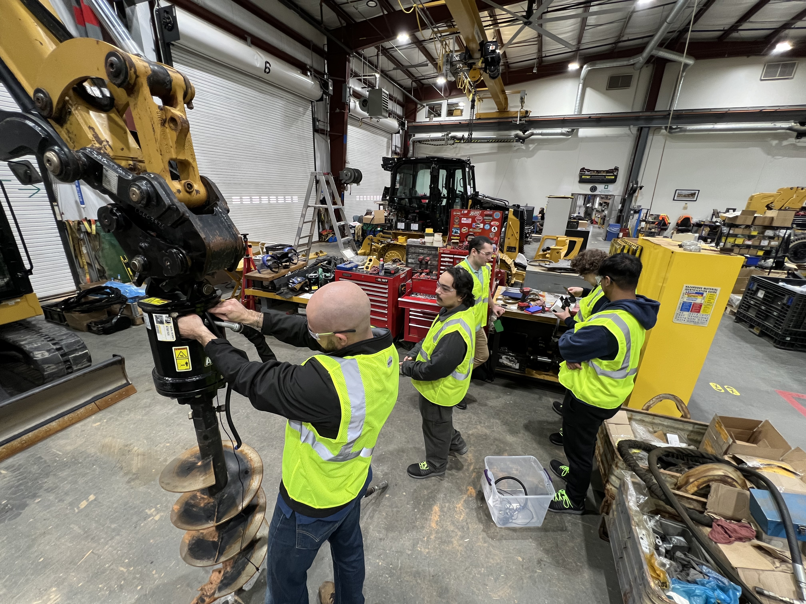
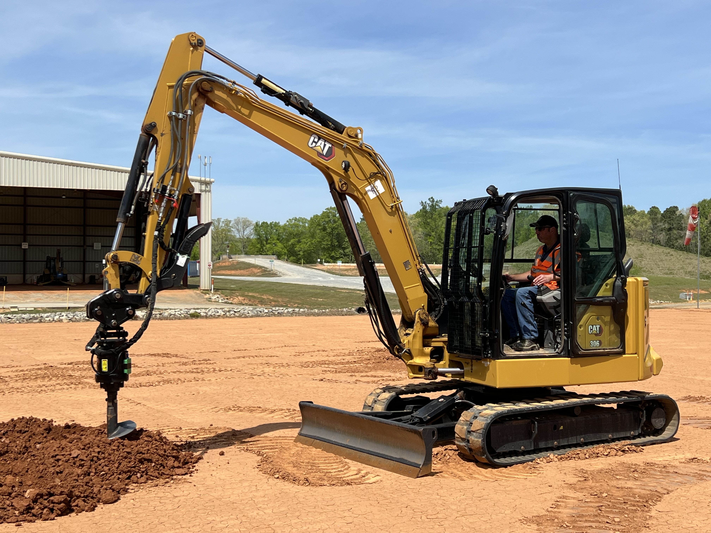
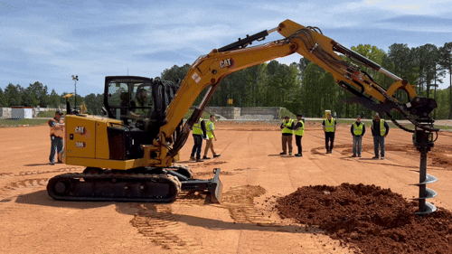

## **Caterpillar Auger Alignment System - CAAS (Senior Design) - Fall 2025/Spring 2026**

### **Project Overview**
The CAAS project was designed to solve a critical efficiency gap in agricultural operations: the precise alignment of augers for material transfer. I served as the Hardware & UI Subsystem Lead, taking the project from initial schematic capture to a field-validated prototype tested at the Caterpillar facility.

#### **My Technical Contributions**
- **Custom PCB Architecture:**Designed a multilayer KiCad PCB that integrated ESP32 microcontrollers with high-precision IMU (Inertia Measurement Unit) unit and custom LED interfaces for real-time angular feedback.
- **Firmware Engineering:** 
    - **Bare-Metal Architecture:** Developed a deterministic "super-loop" in C to manage system states, power regulation, and sensor polling.
    - **Sensor Data Processing:** Developed bare-metal C firmware to process IMU sensor data leaveraging the **i2cdevlib** (from [Jeff Rowberg](https://github.com/jrowberg/i2cdevlib)) and calculate precise Euler angles (Yaw, Pitch, Roll) to determine the auger's orientation relative to gravity.
    - **Real-Time Feedback Optimization:** Architected high-speed data handling logic to process inertial streams, ensuring the LED interface provided smooth, real-time visual feedback for precise field alignment.
    - **Wireless Communication:** Implemented **ESP-NOW** communication protocol to enable reliable, low-latency data transmission between the IMU subsystem and the UI subsystem, implmeenting two-way handshake for connection loss detection and band-switching in case of poor signal strength.
- **User Interface:** Designed an intuitive LED and button interface that provided operators with real-time, precise visual feedback for auger alignment.

#### **Design & Development Process**
- **Conceptualization & Brainstorming:** Evaluated multiple sensor fusion and wireless communication strategies to meet Caterpillar’s requirements for precision and low latency.
- **Breadboard Prototyping:** Developed initial proof-of-concept circuits on breadboards to validate the integration of the ESP32 with the IMU and the LED interface logic.
- **Schematic Transition:** Optimized the breadboard design into a compact, robust KiCad schematic for the custom PCB, carefully managing signal integrity and power delivery across the board.
- **Multi-layer PCB Layout:** Designed a multi-layer PCB in KiCad with a focus on minimizing signal interference (integrated ground plane, decoupling and distributive capacitors for noise suppression, bulk capacitors for power stability, and pull-down resistors on all output pins to prevent floating signals).

#### **Validation & Field-Testing:**
- **Wireless Range Test:** We took the two subsystems outside to a long, open area to test the limits of the ESP-NOW wireless link. We gradually moved the units away from each other while monitoring the signal. We pushed the distance until we finally noticed the connection start to drop. The system successfully maintained a strong, reliable link up to ~400 meters, proving it could easily handle the distance requirements of a standard agricultural auger setup.
- **Environmental UI Validation:** Performed outdoor visibility testing under direct sunlight to ensure the LED interface remained discernible for operators. We simulated the shading conditions of an auger cab to verify that the high-intensity LEDs provided clear alignment feedback in all field lighting conditions.
- **Mechanical Simulation & Data Accuracy:** Constructed a custom wooden frame and used an actual auger housing to simulate real-world movement and vibration within the lab. This allowed us to validate the accuracy of the IMU sensor data and the robustness of the system in a controlled environment.
- **Field Test:** Traveled to the **Caterpillar facility** to test the prototype in a real-world setting. The system performed well, providing operators with clear, real-time visual feedback for auger alignment. Multiple iterations of the LED output and sensor sensitivity were provided during the trials to determine which visual patterns and sensititivites operators preferred. Feedback from operators indicated the system was "easy to learn" and highly effective.

#### **Awards and Recognition:**
- **Best-in-Category Award:** Recognized as the top project within the IoT category at the 2026 North Carolina State University Senior Design Day for technical execution, hardware-software integration, and real-world applicability to industrial challenges.
- **Best Teamwork Award:** Recognized for effective cross-functional collaboration and project management throughout the design, prototyping, and testing phases.
- **Public Exhibition:** Presented the CAAS prototype to the general public and industry professionals, demonstrating the system's ability to improve efficiency in auger operations.

