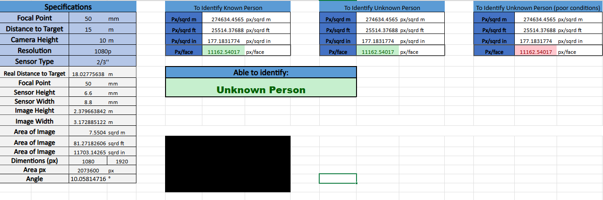

### CCTV Field of View (FOV) & DORI Calculator (PersonalProject) - Summer 2022

[`Project Repository`](https://github.com/lucadaloia/cctv-fov)

#### **Project Overview**
This project involved the engineering of a high-precision optical calculation tool designed to validate security camera placements against the IEC EN62676-4 international standard. The tool allows engineers to input camera specifications (sensor size, focal length, resolution) and environmental variables (distance to target, camera height) to determine if the resulting image quality meets specific operational requirements.

By automating the geometric optics involved in surveillance design, the tool ensures that "Pixels on Target" are sufficient for critical tasks ranging from general detection to positive facial identification in high-stakes transit environments.

#### **Technical Skills Applied** 
- **Optical Engineering:** Applied geometric optics to calculate Horizontal/Vertical Field of View (HFoV/VFoV) and pixel density.
- **Standard Interpretation:** Translated the IEC EN62676-4 (DORI) regulatory framework into functional mathematical logic.
- **Tool Development:** Engineered a multi-stage MS Excel-based analytical engine with user-friendly data entry for field use.
- **Geometric Modeling:** Accounted for camera mounting height and tilt angles to calculate "Real Distance to Target" vs. ground distance.

#### **Engineering & Logic Architecture**
- **DORI Implementation:** The calculator evaluates image quality across four standardized tiers:
    - **Detection:** 25 px/m
    - **Observation:** 62 px/m
    - **Recognition:** 125 px/m
    - **Identification:** 250 px/m
- **Geometric Optics Engine:** By applying Pythagorean theorem and trigonometry, the tool calculates the precise field of view angles and verifies that the horizontal and vertical pixel densities meet the minimum requirements for the specified DORI level.
- **Environmental Variables:** Unlike basic calculators, this tool accounts for the hypotenuse distance (actual path of light) by factoring in the camera’s installation height relative to the target's height.

#### **Calculators & Iterative Design**
The project evolved through several iterations (v001–v008) to increase accuracy and user utility:
- **Sensor Calibration:** Integrated a database of standard sensor sizes (1/4", 1/3", 1/2", 2/3") to ensure accurate width/height constants.
- **Resolution Mapping:** Created presets for common resolutions (720p, 960p, 1080p) to automatically calculate the total pixels available across the calculated FOV.
- **Validation Feedback:** Implemented conditional formatting to provide immediate "Pass/Fail" feedback based on whether the specific target (e.g., "Identify Unknown Person") was met.

#### **Impact and Efficiency**
- **Standardization:** Moved the surveillance design process from "guesswork" to a verifiable, standard-compliant methodology.
- **Risk Mitigation:** Provided a documented audit trail for camera placement, ensuring that identification requirements for security-critical areas were mathematically guaranteed before installation.
- **Cost Optimization:** Optimized focal length selection, preventing the over-specification of expensive high-resolution cameras where lower-cost options met the DORI requirement.

  
  
<i><b>Screenshot of Tool:</b> CCTV Field of View & DORI Calculator</i>

[`Project Repository`](https://github.com/lucadaloia/cctv-fov)