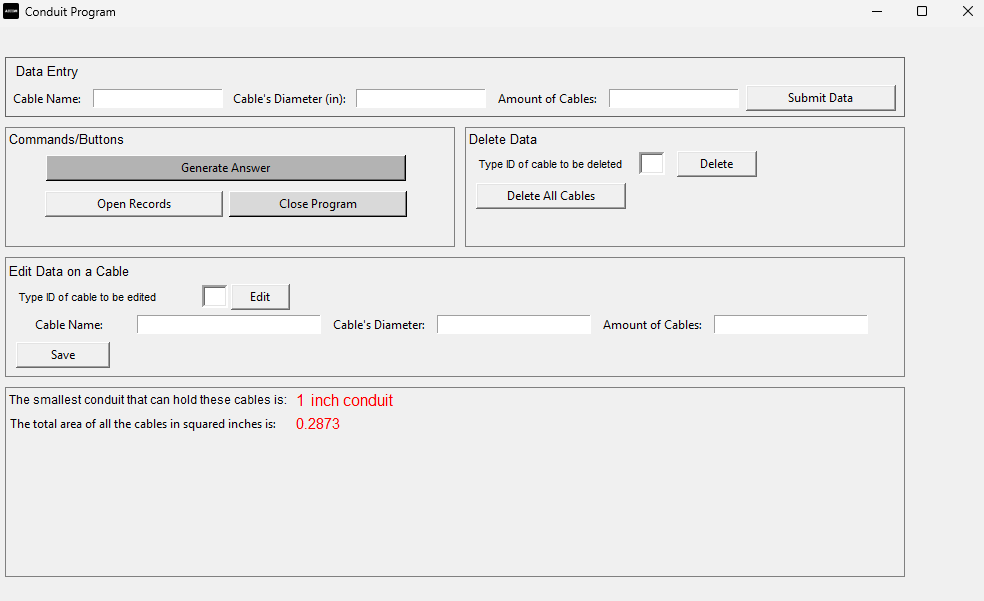
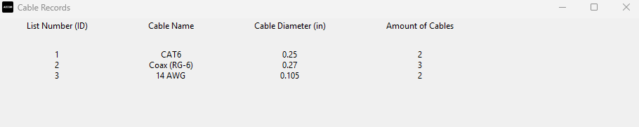

### Conduit Selection Tool (Internship Project) - Summer 2023

[`← Back to Home`](https://github.com/lucadaloia)

[`Project Repository`](https://github.com/lucadaloia/conduit-selection-tool)

#### Project Overview
This project involved the development of a desktop automation tool designed to streamline electrical engineering workflows by calculating National Electrical Code (NEC) compliant conduit fill requirements. The tool replaces manual, error-prone calculations with a Python-based engine that cross-references cable schedules against regulatory fill capacities in real-time.

#### Technical Skills Applied
- **Software Development:** Developed a full-featured desktop application using Python and the Tkinter framework, subsequently converted to a portable .exe file for distribution.
- **Database Management:** Designed and implemented a relational database using SQLite to manage persistent cable specifications, including diameters and quantities.
- **Regulatory Compliance Logic:** Translated complex NEC fill-ratio regulations (e.g., 40% fill for three or more wires) into algorithmic logic to ensure engineering safety and code compliance.

#### Software Engineering & Application Lifecycle
- **Executable Compilation:** Used PyInstaller to bundle the Python source code, SQLite databases, and image assets into a single .exe file, streamlining the deployment process for end-users.
- **Relational Data Archiving:** Utilized sqlite3 to create a backend that allows users to save, edit, and delete cable records through a dedicated management window.
- **Dynamic UI Updates:** Engineered an asynchronous refresh mechanism that updates the database view uppon data modifications.

#### NEC Compliance Engine & Logic
- **Automated Selection:** Developed a search algorithm that iterates through standard conduit sizes to identify the smallest diameter satisfying calculated cable area requirements.
- **Fill Percentage Logic:** Programmed a decision logic to apply the correct NEC fill percentage based on the total cable count.
- **Precision Implementation:** Leveraged the **math** library for high-precision cross-sectional area calculations, ensuring outputs align with strict industry standards.

#### Impact and Efficiency
- **Risk Mitigation:** Eliminated human error associated with manual NEC table lookups, reducing the risk of project delays and non-compliance.
- **Workflow Acceleration:** Significantly reduced the time required to generate compliant conduit schedules for engineering bids and field installation plans.

  
  
<i><b>Main Application Window:</b> Contains database management sections and result window.</i>

  
  
<i><b>Database View Window:</b> Contains cables and information added to database</i>

[`Project Repository`](https://github.com/lucadaloia/conduit-selection-tool)