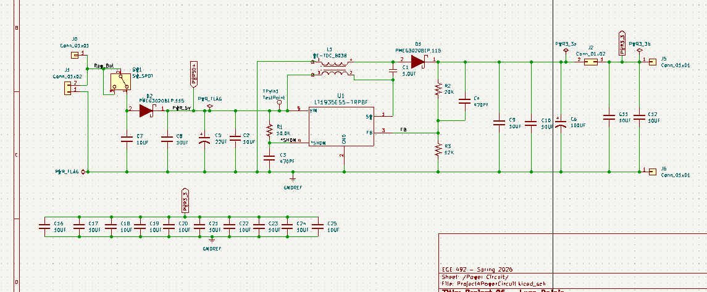
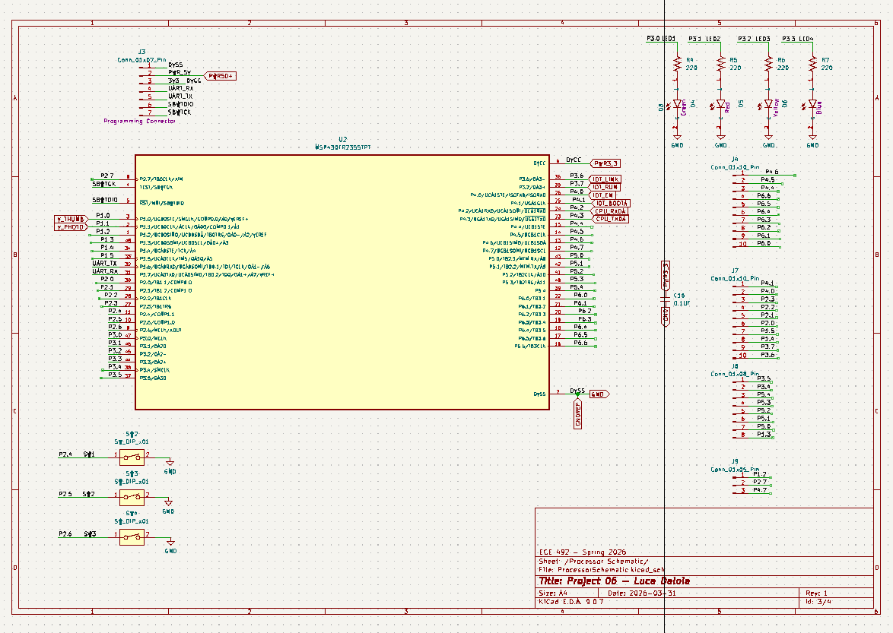
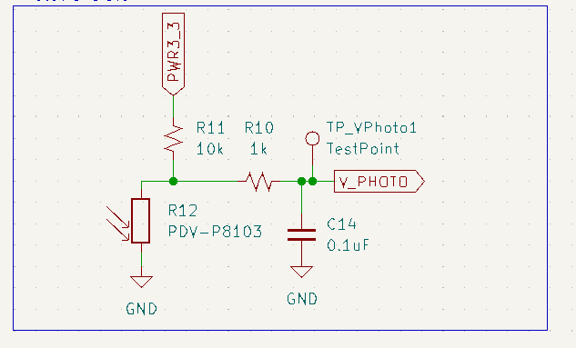
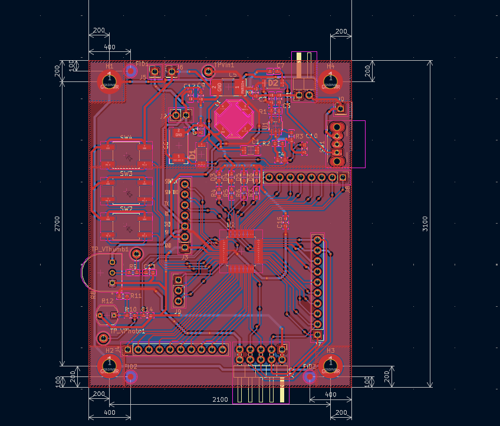
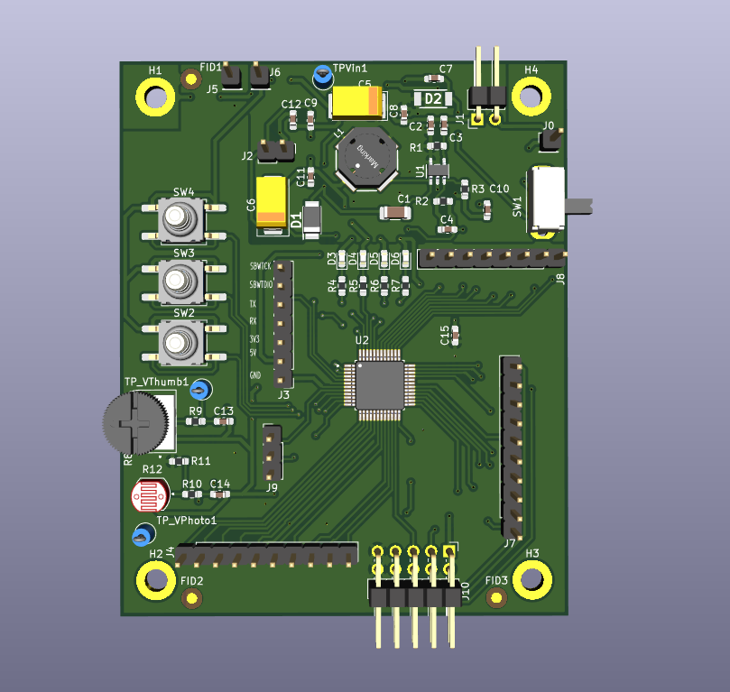
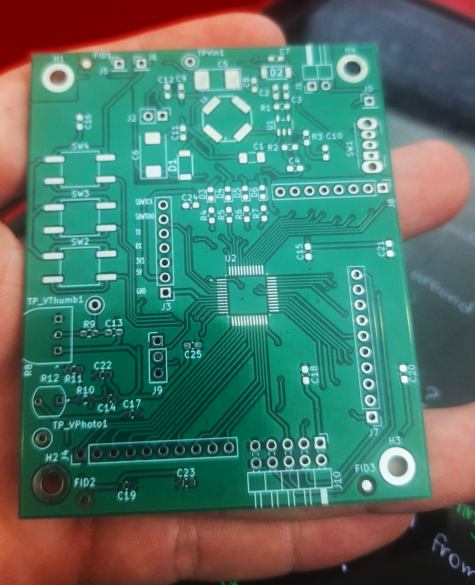
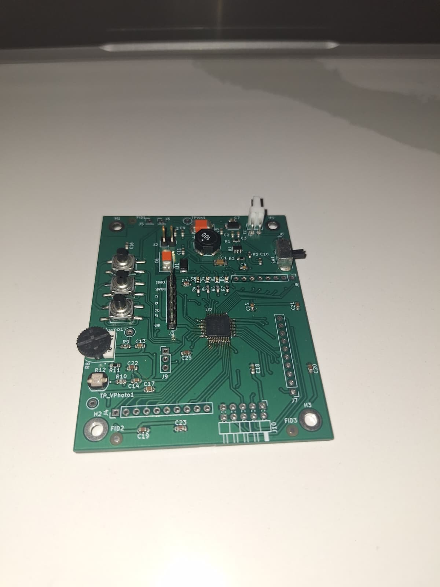

## **Custom PCB Design (ECE 492 course) - Spring 2026**

[Project Repository](https://github.com/lucadaloia/MSP430-LDR_ECE492)

#### **Project Overview**
This project involved the design and manufacturing of a microcontroller-based system focused on analog signal acquisition and real-time user interaction. The system utilizes a photoresistor (LDR) for environmental sensing and a tactile user interface, all managed by a custom-designed PCB and optimized C firmware.

#### **Technical Skills Applied**
- **Power Circuit Design:** Designed a custom power circuit based on manufacturer specifications, including selection of appropriate components.
- **PCB Layout and Routing:** Developed a multi-layer PCB in KiCad, managing complex routing challenges such as power planes and signal integrity.
- **Firmware Development:** Programmed the microcontroller in bare-metal C, implementing high-speed peripheral communication and real-time data processing.
- **Component Selection:** Selected appropriate components based on manufacturer datasheets and system requirements.
- **Simulation:** Validated the power circuit design using LTspice simulations.
- **Validation and Testing:** Tested the prototype using a multimeter to verify functionality and signal integrity.

#### **Hardware Engineering & Circuit Design**
- **Analog Interfacing:**  Designed a voltage divider circuit for a Photoresistor (LDR) to translate light intensity/proximity into a measurable voltage range for the MSP430's ADC (Analog-to-Digital Converter).
- **Signal Conditioning:** Integrated an RC low-pass filter to suppress high-frequency noise.
- **Power Integrity & Noise Suppression:** Strategically placed decoupling capacitors (0.1µF) near the MCU power pins and distributive bulk capacitors across the power rails to provide a stable power source for the microcontroller and LEDs.
- **User Interface Subsystem:** Integrated three tactile buttons and an LED array.
- **Power Circuit Design:**  Designed a custom power circuit based on manufacturer specifications, including selection of appropriate components.

  
  
<i><b>Schematic Capture:</b> Power circuit using LTI1935ES5</i>

  
  
<i><b>Schematic Capture:</b> Processor circuit using MSP430, LEDs and Buttons</i>

  
  
<i><b>Schematic Capture:</b> Sensor circuit using LDR</i>

#### **C Firmware & Embedded Systems Development**
- **Interrupt-Driven Architecture:** Developed ISRs (Interrupt Service Routines) to handle button presses and ADC channel switching, minimizing CPU overhead and ensuring instantaneous system response.
- **Calibration Logic:** Programmed a dedicated calibration routine that, upon a button trigger, samples the ambient light levels and dynamically offsets the system’s baseline "initial value."
- **ADC Signal Processing:** Implemented C firmware for channel switching and processing 10-bit ADC values, converting raw voltages into meaningful levels for display.
- **Multi-Mode Display Logic:** Developed two distinct visual output algorithms:
    - Gradual Mode: A sequential logic that scales LED intensity/count based on proximity.
    - Binary/Flash Mode: A low-latency mode that activates the full array simultaneously upon reaching a programmed threshold.

#### **PCB Design & Physical Layout**
- **Trace Routing:** Manually routed all connections on a 2-layer board, ensuring that "power" traces were wide enough to handle current and that "signal" traces were laid out clearly to avoid crossing wires.
- **Copper Pours:** Added a Ground and PWR Plane to provide a common return path for all components, which helps stabilize the circuit and makes soldering easier.

  
  
<i><b>PCB Layout</b></i>

  
  
<i><b>PCB 3D Render</b></i>

#### **Manufacturing & Hardware Assembly**
- **Production Files:** Produced a complete manufacturing package including Gerber files, NC Drill files, and a Bill of Materials (BOM) to facilitate professional PCB fabrication.
- **Precision Assembly:** Performed full board population using a mix of soldering techniques based on component geometry. I used a soldering iron for larger connectors and through-hole parts, while utilizing a heat plate and hot air rework station for precise placement of smaller SMD components.

  
  
<i><b>Empty PCB</b></i>

  
  
<i><b>Populated PCB</b></i>

  
  
<i><b>Video of Functioning System</b></i>

 [`Project Repository`](https://github.com/lucadaloia/MSP430-LDR_ECE492)

