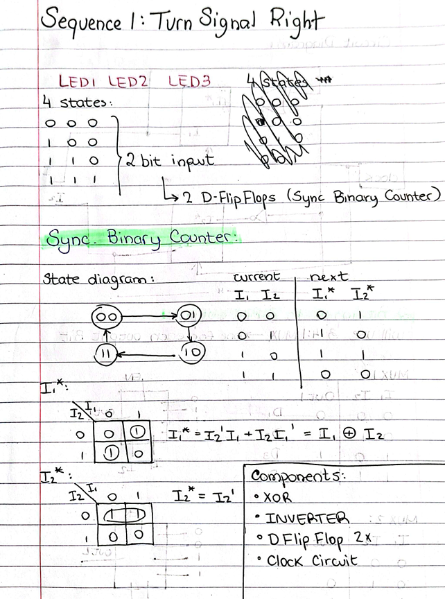
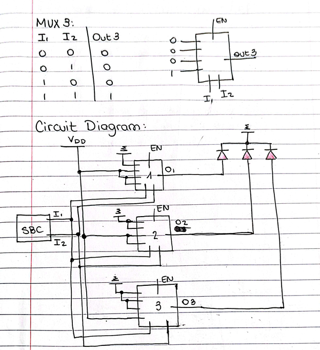
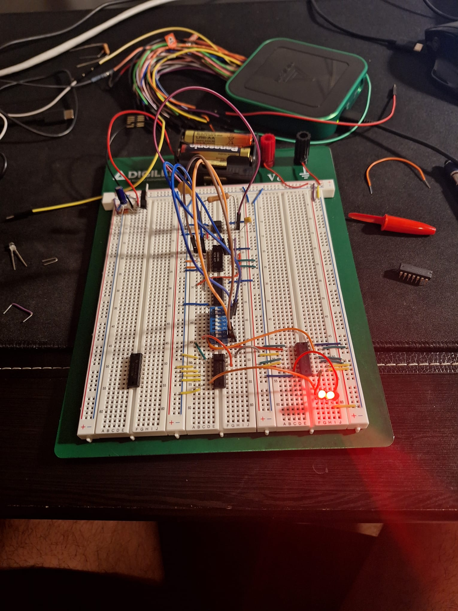
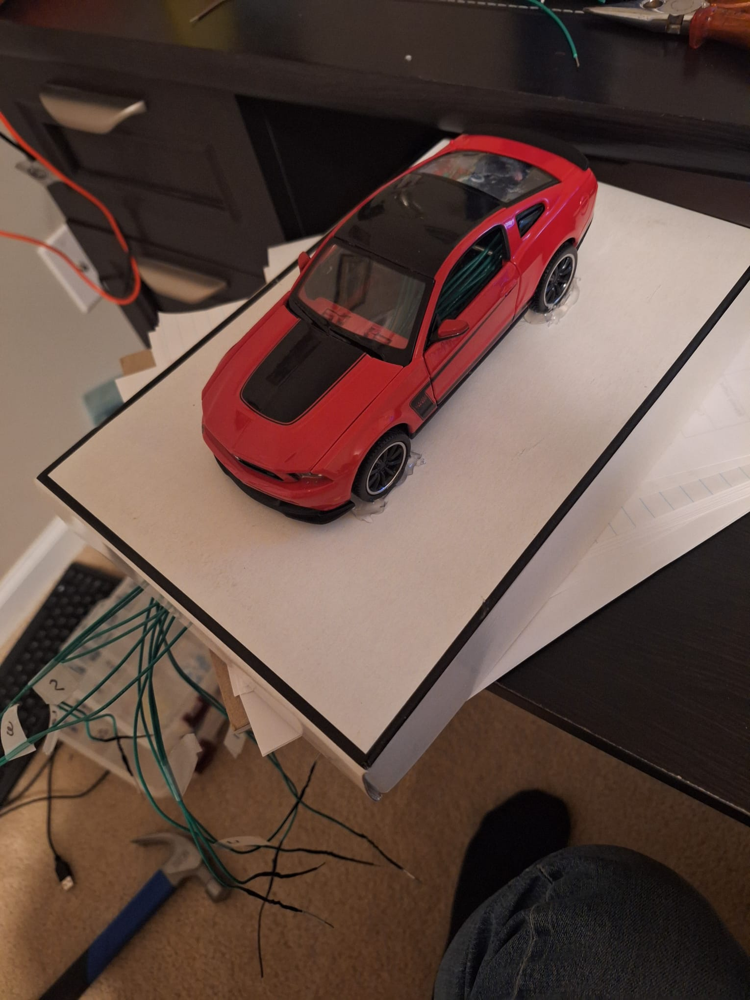

### Sequential LED Turn Signals (ECE 212) - Spring 2025

[`← Back to Home`](https://github.com/lucadaloia)

#### **Project Overview**
This project involved the design and implementation of a hardware-based state machine to emulate modern sequential turn signals for a 1:24 scale Mustang model. By utilizing fundamental digital logic components and timing circuits, the system manages a specific sequence of LED activations, translating manual switch inputs into a fluid visual transition.

#### **Technical Skills Applied**
- **Digital Logic Design:** Utilized Boolean algebra and Karnaugh Maps (K-Maps) to simplify logic expressions and minimize the required gate count.
- **State Machine Architecture:** Designed a synchronous sequential circuit using D Flip-Flops to cycle through specific lighting states.
- **Timing & Oscillation:** Configured a 555 Timer in astable mode to provide a consistent clock signal for the sequential logic.
- **Prototyping & Integration:** Transformed theoretical schematics into a physical circuit integrated within the chassis of a scale model vehicle.

#### **Hardware Engineering & Circuit Design**
- **Clock Generation:** Implemented a 555 Timer IC to generate the pulse-width modulated (PWM) signal required to drive the state transitions.
- **Sequential Logic:** Integrated D Flip-Flops to serve as the memory elements of the state machine, holding the "state" of which LEDs should be illuminated.
- **Combinational Logic:** Used a series of AND, OR, and NOT gates (via IC chips) to decode the current state into the specific LED output pattern.

#### **Logic Design & Optimization**
- **State Transition Table:** Developed a formal state table to map the transition from "All Off" to "Inner LED," "Middle LED," and finally "Outer LED."
- **K-Map Simplification:** Applied Karnaugh Mapping to the state table to derive the most efficient Boolean expressions for the D-inputs of the flip-flops.
- **Manual Optimization:** Reduced the physical footprint of the circuit by identifying redundant gates and utilizing multi-gate IC packages.

#### **Manufacturing & Hardware Assembly**
- **Breadboard Prototyping:** Validated the timing intervals and logic sequences on a breadboard prior to final assembly to ensure the "sweep" effect was visually smooth.
- **IC Integration:** Carefully mapped pinouts for 74-series logic chips, ensuring stable power delivery and ground paths across the logic array.

  
  
<i><b>Page of Logbook:</b>State Diagrams and K-Maps</i>

  
  
<i><b>Page of Logbook:</b> Circuit Diagram</i>

  
  
<i><b>Breadboard with Wires and Components</b></i>

  
  
<i><b>1:24 Scale Mustang Model</b></i>

  
  
<i><b>Functioning System</b></i>

[`Project Writeup`](media/ece212_project-writeup.pdf) for more details

