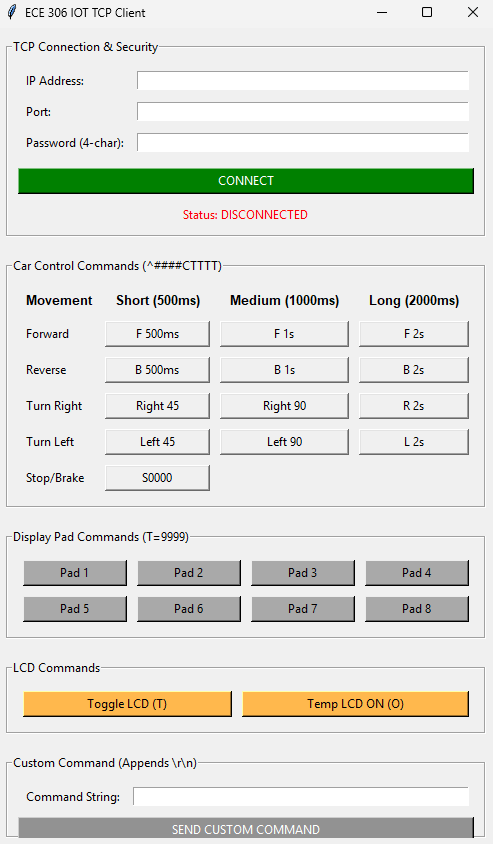
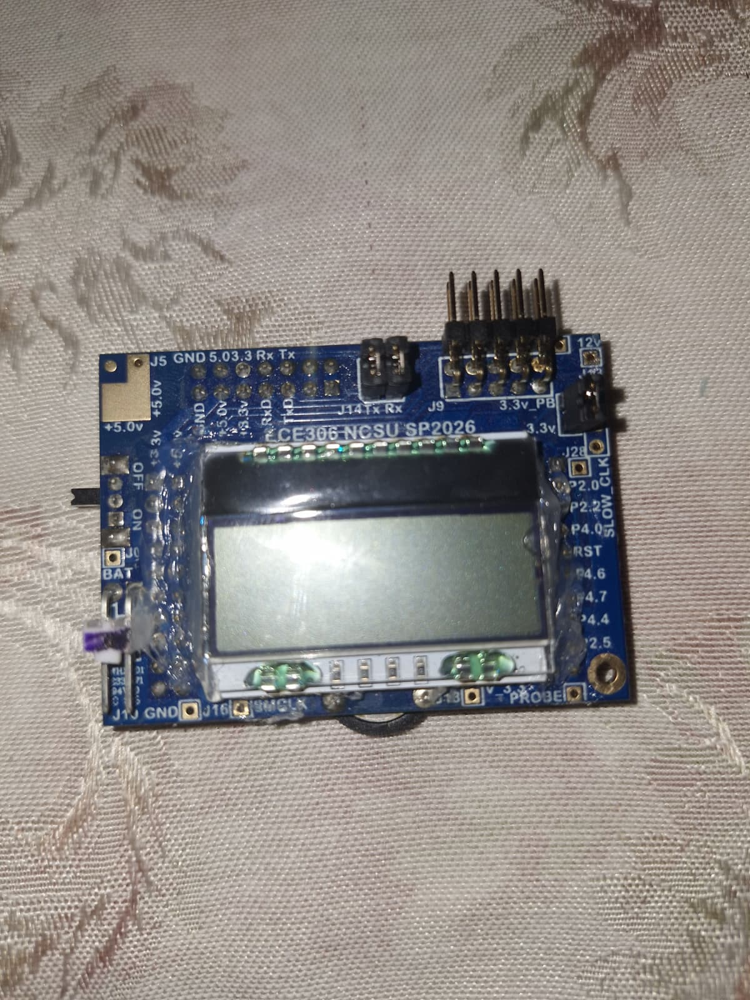
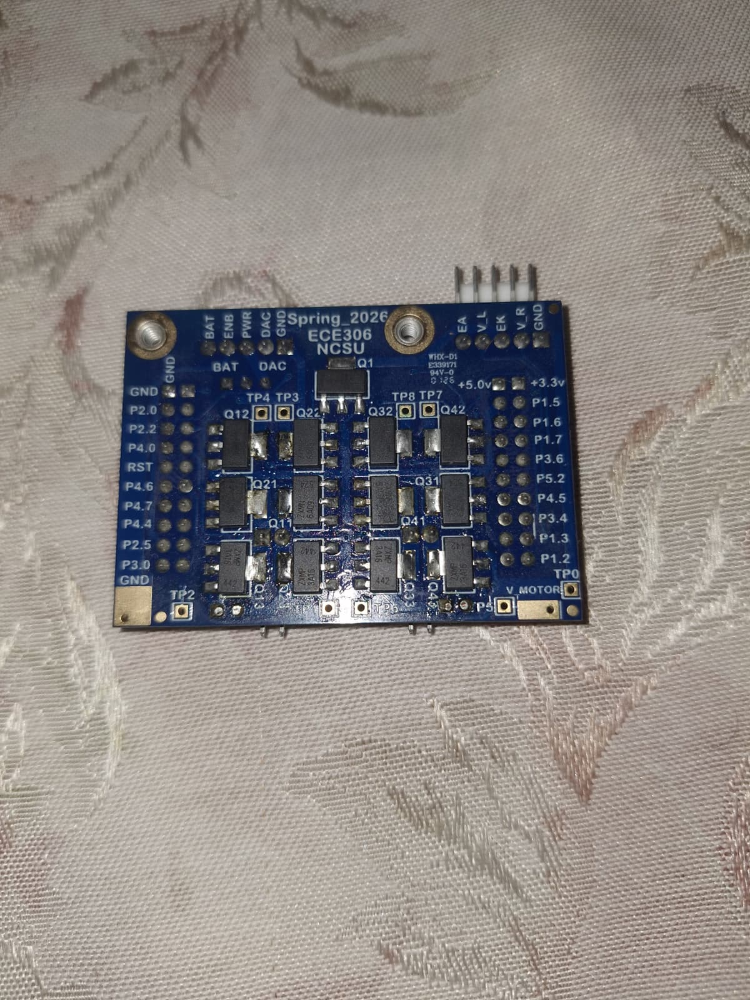
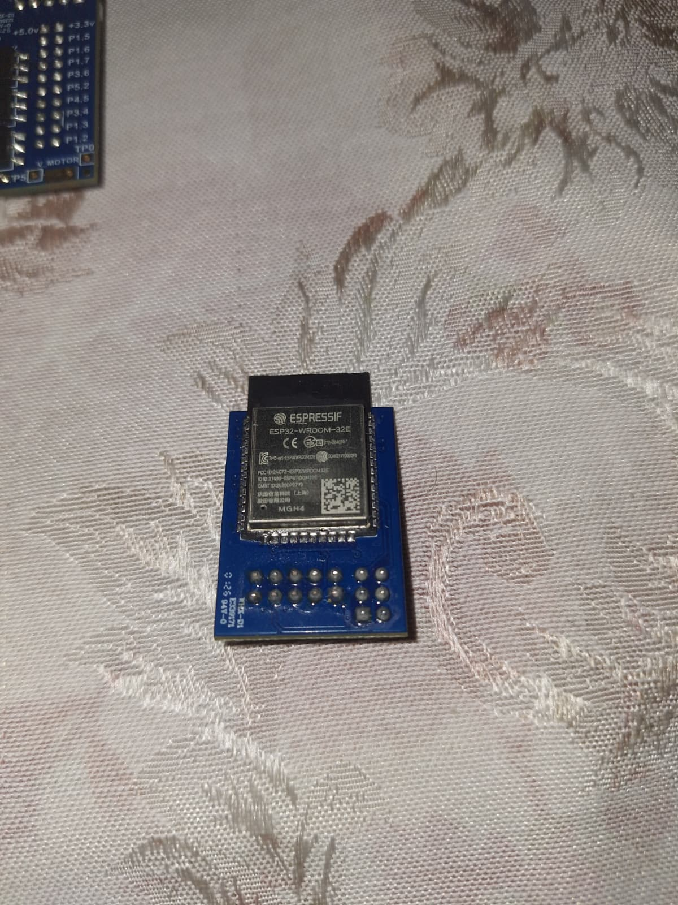
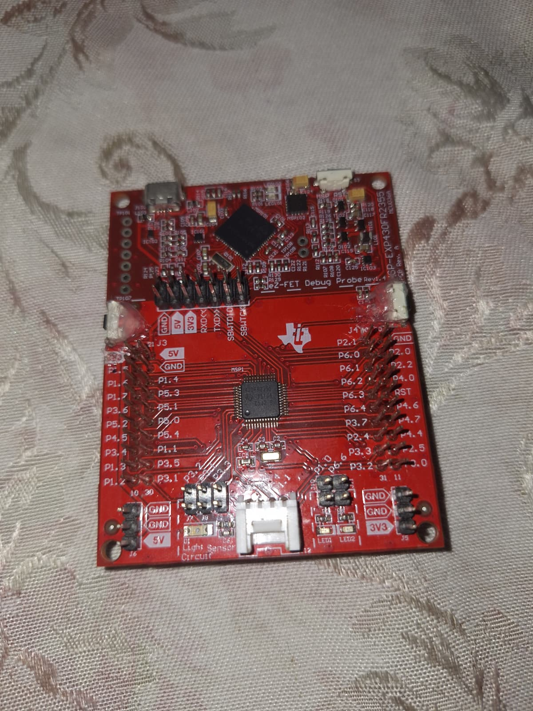
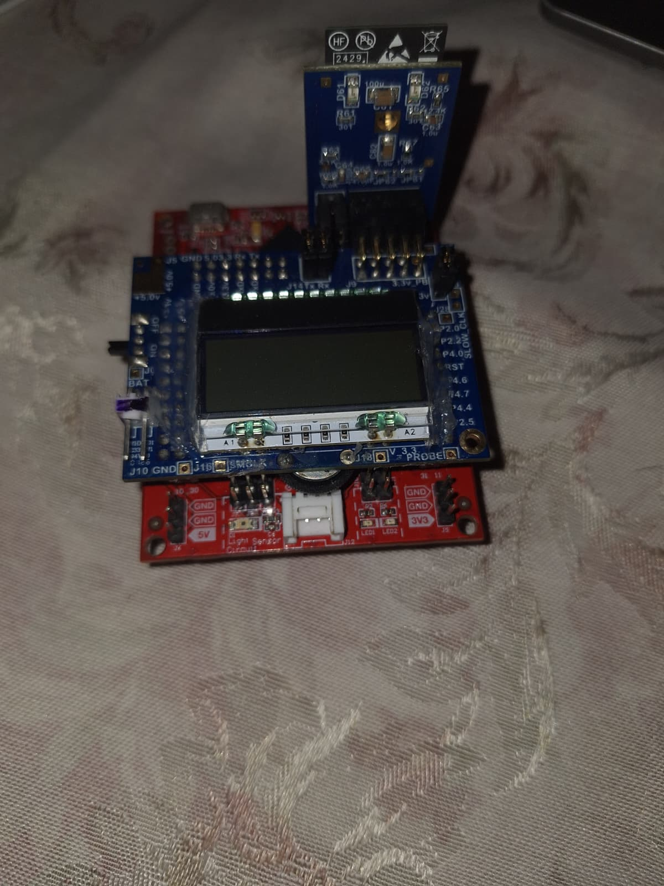
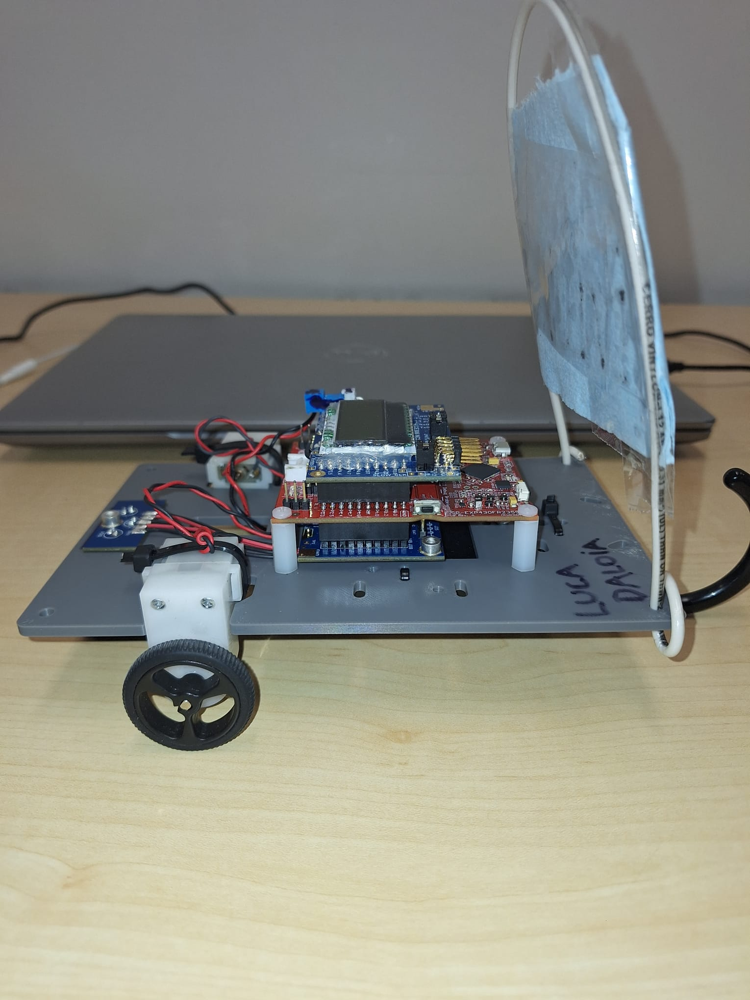

## **Autonomous IoT Robotic Platform (ECE 306 course) - Fall 2025**

[Project Repository](https://github.com/lucadaloia/MSP430_IoT_Car_ECE306)

#### **Project Overview**
This project involved the system integration and firmware development of an autonomous robotic platform centered on the MSP430 (FRAM) microcontroller. I integrated an ESP32 as a wireless co-processor using AT commands over UART to enable TCP/IP remote steering alongside a PID-based autonomous mode. I performed board population and hardware-in-the-loop validation, using an Analog Discovery 3 to ensure signal integrity across the motor control and sensor subsystems.

#### **Technical Skills Applied**
* **Embedded System Integration:** Integrated disparate hardware modules—including an **MSP430FR2355 (FRAM)** main controller, an **ESP32** co-processor, and different boards designed by the professor — into a synchronized, functional robotic system.
* **Asynchronous Serial Communication:** Developed a robust UART communication stack featuring interrupt-driven Circular (Ring) Buffers to ensure non-blocking, reliable data exchange between the MCU and the wireless module.
* **Firmware Development (Bare-Metal C):** Authored low-level C code for real-time task management, including custom message parsing functions, PWM motor control, and state-machine logic for autonomous navigation.
* **Control Theory Implementation:** Developed and tuned a PID controller to process IR sensor error signals, achieving smooth and stable autonomous line-following.
* **Wireless Networking & IoT:** Utilized AT Command sets to configure the ESP32 for TCP/IP socket communication, enabling remote manual control over a wireless network.
* **Hardware Validation & Debugging:** Proficient in using the Analog Discovery 3 (Logic Analyzer and Oscilloscope) to decode UART packets and verify PWM duty cycles for system calibration.
* **Cross-Platform Tool Development:** I developed a Python-based Tkinter GUI to serve as a centralized remote control station for the robotic platform. The interface features dedicated controls for navigation (timing-based movement), display pad triggers, and LCD toggling.
* **Technical Documentation:** Authored comprehensive project writeups detailing firmware architecture, hardware implementation steps, and validation procedures for cross-functional review.

#### **System Architecture & Control Logic**
This robotic platform operates through a multi-layered control stack, balancing high-speed autonomous reaction with high-level IoT commands.

* **PID-Based Autonomous Navigation:** To achieve smooth movement on the track, I implemented a PID (Proportional-Integral-Derivative) controller. The firmware samples an IR sensor array via ADC, calculates the error relative to the black line, and applies corrective PWM signals to the motors to prevent oversteering.
* **Interrupt-Driven Serial Stack:** I developed a robust UART communication interface using Circular (Ring) Buffers. By using ISRs (Interrupt Service Routines) to handle incoming bytes, the system can receive wireless commands from the ESP32 without interrupting the timing-critical PID calculations.
* **State-Machine Integration:** The firmware utilizes a central command state machine to switch seamlessly between autonomous "Line-Follow" mode and manual "IoT-Remote" mode based on packets received from the network.

#### **Cross-Platform IoT Controller**
I developed a custom desktop application to serve as the "Ground Control" for the robot, bridging the gap between a PC and the bare-metal hardware.
* **Python (Tkinter) GUI:** The interface allows for real-time interaction with the car, featuring custom buttons for timed movements (500ms to 2000ms), LCD toggling, and a raw command console.
* **TCP/IP Networking:** To enable wireless control, I implemented TCP/IP socket communication in Python. I utilized AI-assisted prototyping to structure the network stack, allowing the application to send standardized command strings (e.g., ^####CTTTT) to the robot's IP address.
* **Protocol Parsing:** I designed a dedicated parsing logic on the MSP430 to decode these specific strings, ensuring that even in a noisy wireless environment, only valid, formatted commands are executed by the motor drivers.

  
  
<i><b>Python (Tkinter) GUI:</b> TCP/IP Terminal Interface</i>

#### **Hardware Implementation & Validation**
While the project utilized provided PCB designs, I was responsible for the transition from a bare board to a fully functional, validated system.
* **Precision Assembly & Soldering:** I soldered a diverse range of components including pin headers, tactile switches, and the LCD display. My work involved both through-hole soldering for structural components and SMD (Surface Mount Device) soldering for high-density passives and ICs.
* **Signal Integrity Testing:** I used an Analog Discovery 3 as both a Logic Analyzer and an Oscilloscope to verify the hardware. This included "sniffing" the UART bus to debug the communication between the MSP430 and ESP32 and checking PWM duty cycles to calibrate motor speeds.
* **Comprehensive Documentation:** For each stage of the build, I authored a technical writeup. These reports detail the code logic, flowcharts of the ISR routines, and a log of hardware-in-the-loop testing results to ensure the system met all performance specifications.

  
  
  
<i><b>LCD/Power Board (Left) and FET Board (Right)</b></i>

  
  
  
<i><b>IoT Board (Left) and MSP430 FRAM Board (Right)</b></i>

  
  
<i><b>Stacked/Assembled Boards</b></i>

  
  
<i><b>Side View of Assembled Boards on Chassis</b></i>

### **System Demonstration**

  
  
<i><b>System Demonstration:</b> Manual IoT Remote Control</i>

  
  
<i><b>System Demonstration:</b> Autonomous Line-Following</i>

 [`Project Repository`](https://github.com/lucadaloia/MSP430_IoT_Car_ECE306)