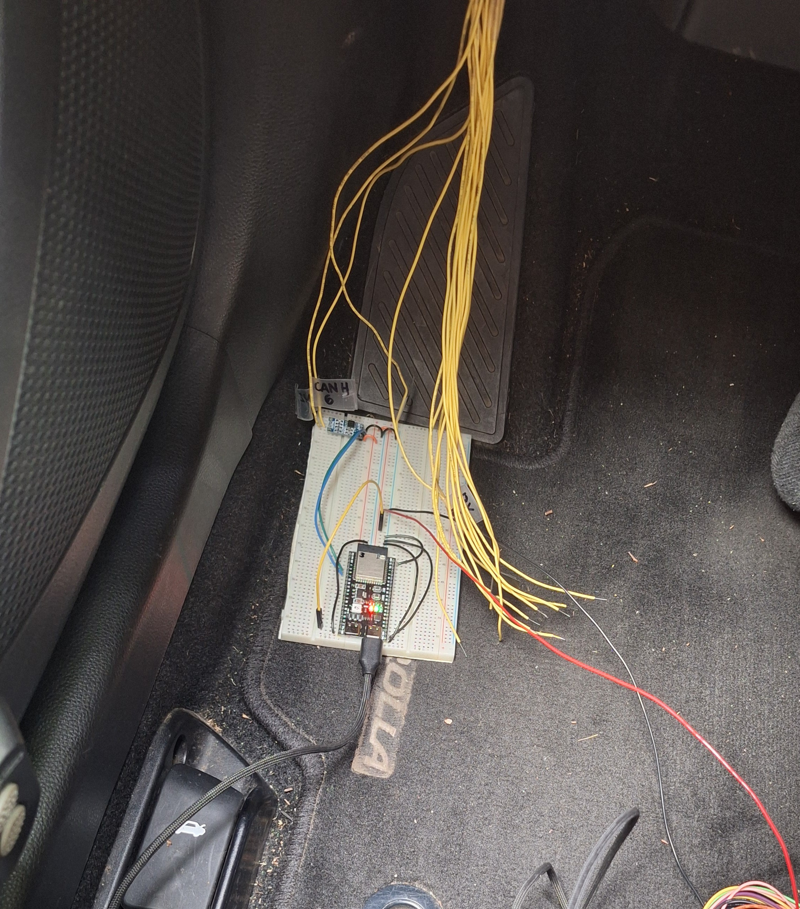
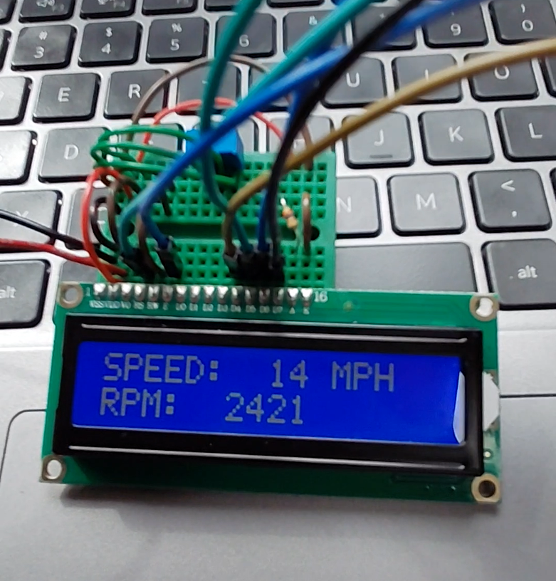

## **Automotive OBD2 Heads-Up Display (HUD) - Personal Project - In Progress (2026)**

[`← Back to Home`](https://github.com/lucadaloia)

### **Project Overview**
This project involves the design and development of an automotive embedded system that extracts vehicle diagnostics in real-time and projects them into the driver's line of sight. The system operates as a wireless dual-node network utilizing two ESP32 microcontrollers. A base node connects to the car's OBD2 port to fetch parameter IDs (PIDs) like RPM and vehicle speed over the CAN bus, which it then transmits wirelessly via ESP-NOW to a dashboard-mounted receiver node. The receiver node processes the incoming payload to drive a high-density color TFT display configured for optical heads-up projection.

### **Technical Skills Applied**
- **Automotive Network Interfacing:** Interfaced directly with vehicle hardware protocols using a CAN Transceiver to capture high-speed OBD2 parameter IDs (PIDs).
- **Wireless Networking:** Implemented low-latency, asynchronous communication protocols using ESP-NOW for point-to-point wireless data serialization.
- **PCB Layout and Routing:** Executing custom multi-layer schematic capture and PCB design in **Altium Designer** to manage high-density connector footprints and power constraints.
- **Firmware Development:** Writing optimized C++ firmware to handle timing-critical CAN bus query-response routines and low-level display rendering.
- **Prototyping & Validation:** Building and debugging hardware proof-of-concepts using benchtop setups, character displays, and systematic diagnostic troubleshooting.
- **Engineering Documentation:** Maintaining a rigorous technical logbook to systematically track architectural modifications, hardware troubleshooting, and layout iterations.

### **Hardware Engineering & Circuit Design**
- **CAN Bus Interfacing:** Designed a hardware gateway utilizing a CAN Transceiver to bridge the physical differential signalling of the car’s OBD2 network with the ESP32 logic levels.
- **High-Density Display Integration:** Integrated a 20-pin FPC ribbon Newhaven color TFT display (NHD-2.4-240320CF-BSXV-F), managing fine-pitch connector pinouts and signal routing constraints.
- **Power Management:** Architected power circuitry capable of regulating noisy automotive power drops/spikes down to stable supply voltages for the transceiver and microcontrollers.
- **Dual-Node Topology:** Formulated a clean separation between the data-collection node (OBD2-mounted) and the display-projection node (dash-mounted) to eliminate cabin wiring and safety hazards.

### **C++ Firmware & Embedded Systems Development**
- **Diagnostic Heartbeat & Query Routines:** Developed firmware routines in C++ to transmit periodic heartbeat signals to the car's ECU and manage continuous, low-latency PID request loops.
- **Wireless Payload Serialization:** Programmed low-level ESP-NOW data transmission protocols to serialize vehicle telemetry into highly optimized payloads, minimizing transmission delay.
- **TFT Display Drivers:** Structured custom display drivers to map raw diagnostic values into 240x320 color graphic interfaces optimized for mirroring and heads-up reflection.
- **Asynchronous Data Handling:** Implemented non-blocking firmware loops to ensure display refresh rates remain fluid while concurrently processing incoming wireless telemetry packets.

### **PCB Design & Physical Layout**
- **Schematic Capture:** Actively generating multi-layer circuit schematics within Altium Designer to consolidate the ESP32, CAN transceiver, power regulation components, and peripheral passives.
- **High-Density Routing:** Routing complex, narrow trace paths required by the 20-pin FPC ribbon cable connector while maintaining strict power and signal plane isolation to prevent EMI from the vehicle cabin.
- **Form Factor Optimization:** Designing the physical layout to fit safely inside a small-form-factor enclosure that plugs seamlessly into standard under-dash OBD2 ports without impeding driver movement.

### **Engineering Documentation & Validation**
- **Iterative Bench Prototyping:** Validated the initial firmware stack and network communication layer on a breadboard system using a temporary alphanumeric LCD panel to guarantee CAN-to-wireless packet integrity.
- **Technical Logbook Maintenance:** Documented each distinct stage of the project, establishing an active registry of firmware modifications, display initialization state codes, component sourcing adjustments, and hardware troubleshooting sessions.

  
   
  
<b>Breadboard Prototype:</b> <i>Prototype connected to OBD2 port.</i>

  
   
  
<b>Display LCD Prototype:</b> <i>Prototype displaying speed and rpm.</i>

